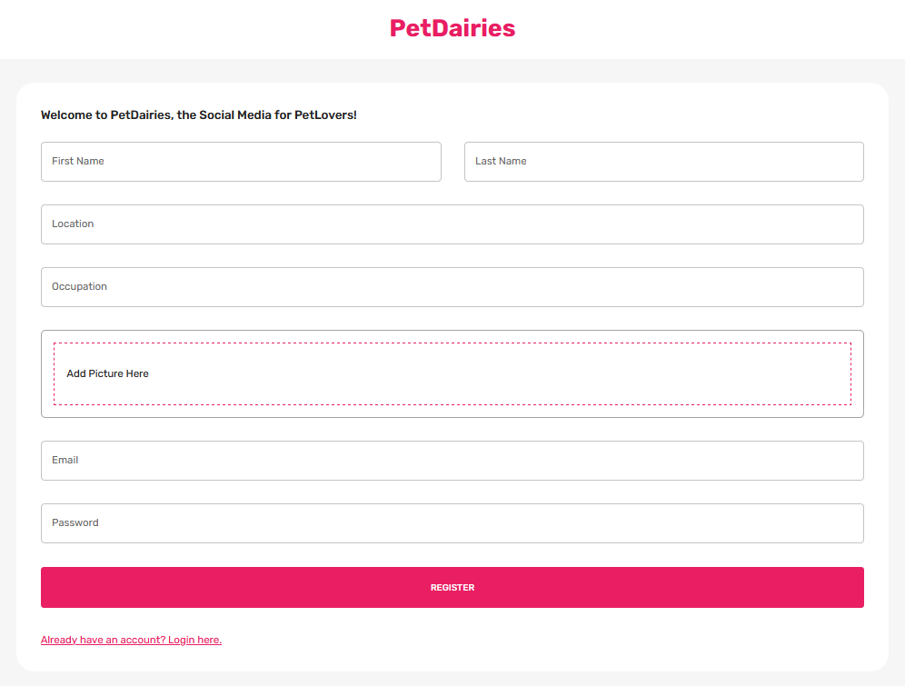
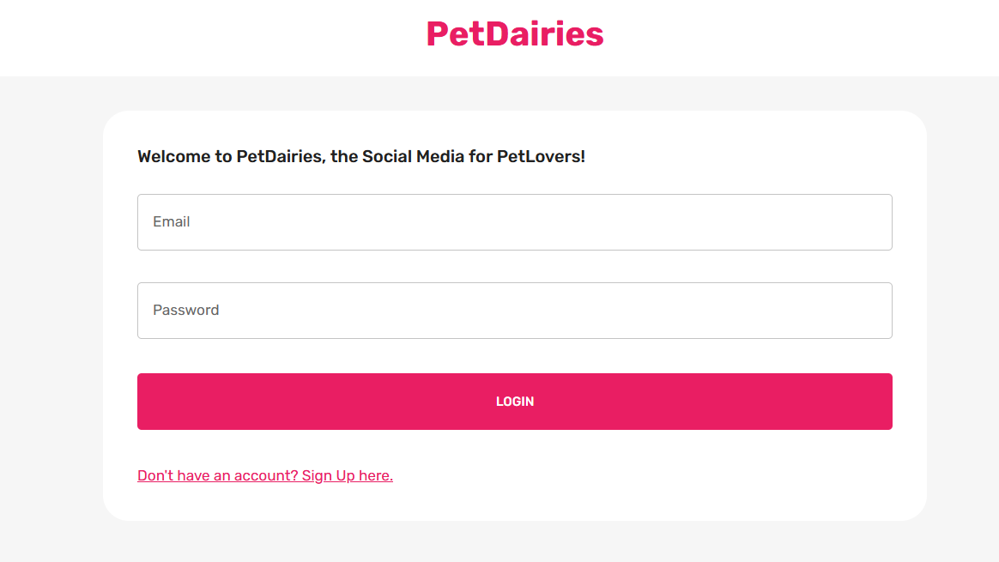
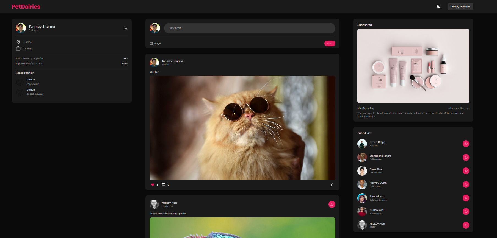
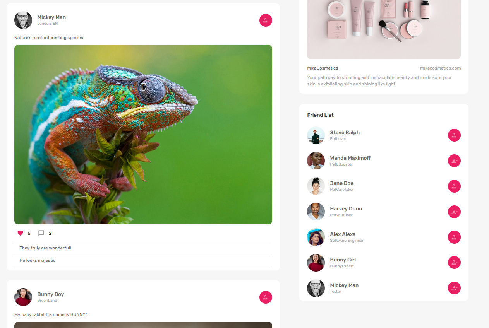
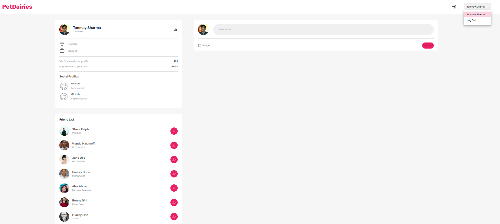
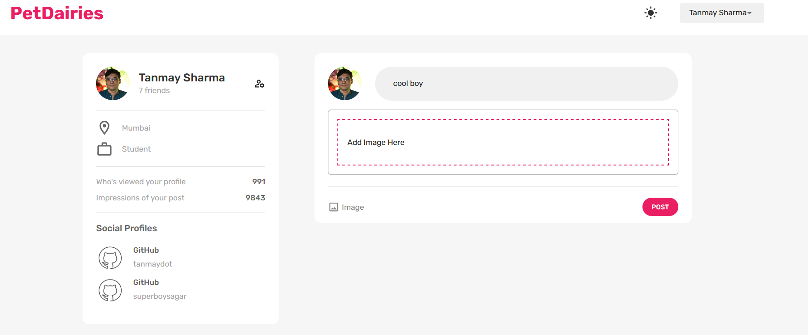
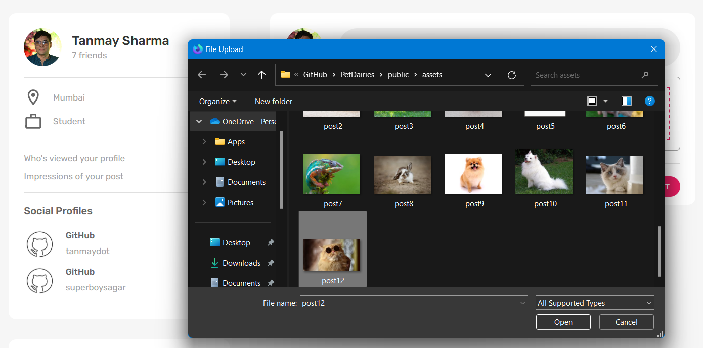
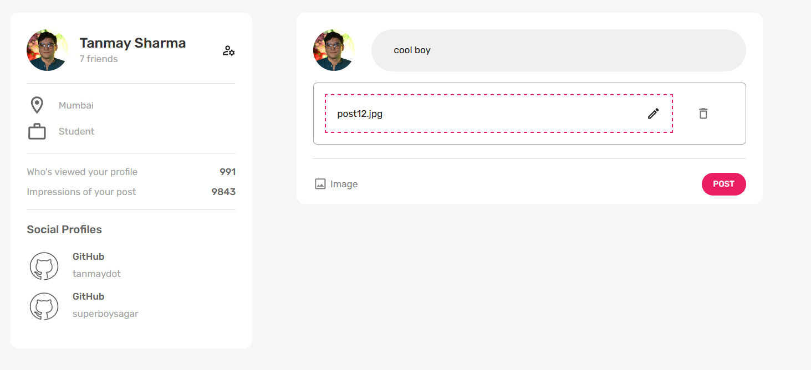
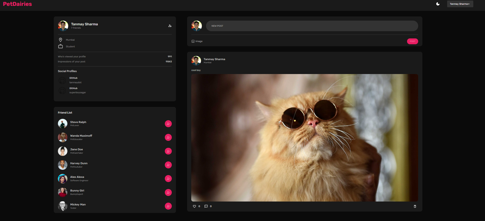

# **MERN FullStack Social Media App**

## A Social Media Web Application For PetLovers!

---

## [DEMO](https://pet-diaries.vercel.app/)

- Deployed on [Vercel](https://vercel.com) and [Render](https://render.com/)
- Wait for 30 second time for the server to start after clicking on the log in button
- Note : ``` First access the website in the test account so you won't have any problems while creating a new account ```

---

the test account details
- email : ```test@test.com```
- password : ```test```

---

## ScreenShots



















---

## Future Updates :-> 
- Comments Feature
- Adoption Center or Shelters Nearby
- Sharing Feature
- Video Uploads

## Know bug
- While adding a post from the user profile page; every post from every user is visible in the user profile page

---

## Technology Used

Here are some of the technologies used in this project:

- [MongoDB](https://www.mongodb.com/)
- [Express.js](https://expressjs.com/)
- [React](https://reactjs.org/)
- [Node.js](https://nodejs.org/)

---

## Acknowledgements

[ED ROH](https://github.com/ed-roh/mern-social-media)

---
