# **FullStack Social Media App**

- _React MERN Social Media App inspired from <https://github.com/ed-roh/mern-social-media>_

---

## ScreenShots

- LIGHT MODE

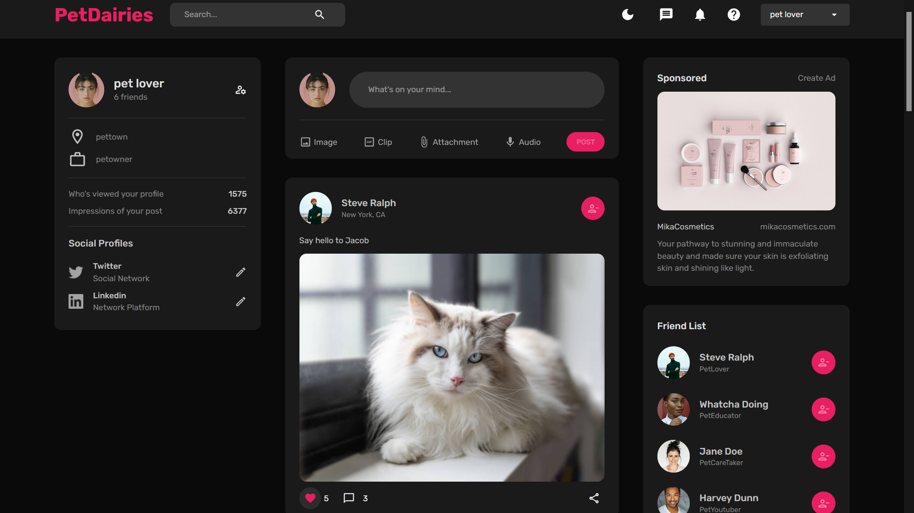

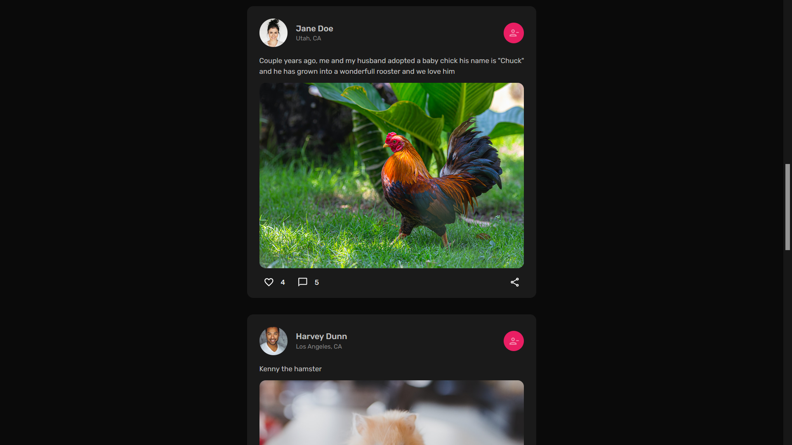

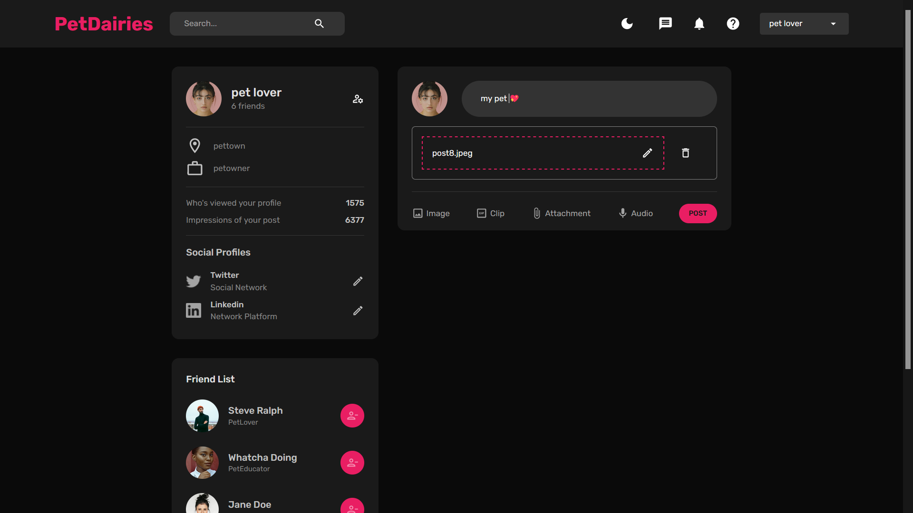

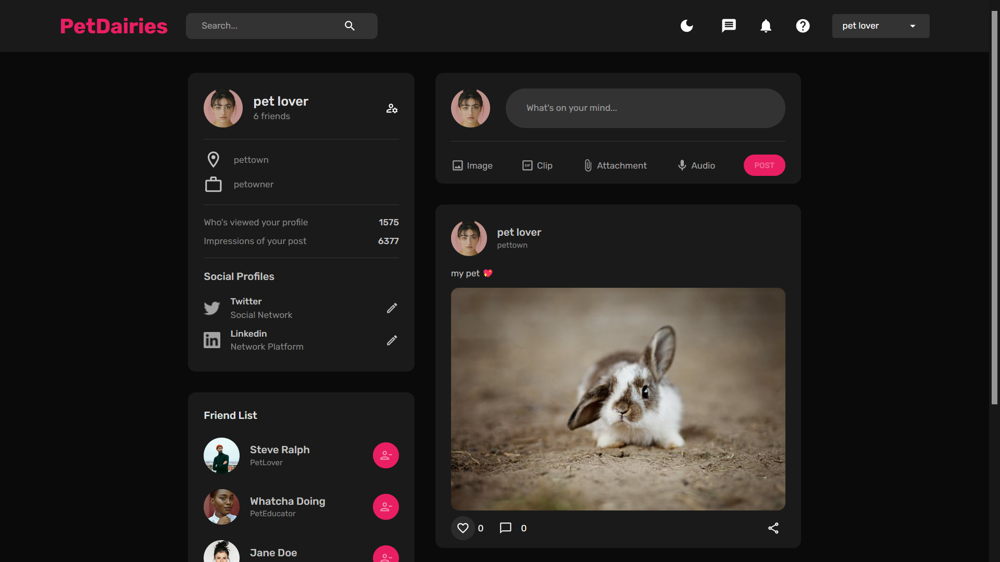

- DARK MODE

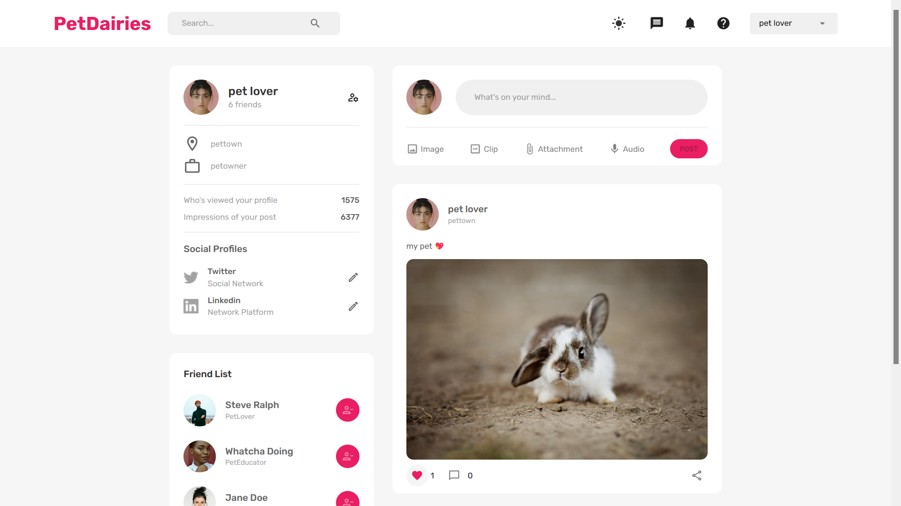

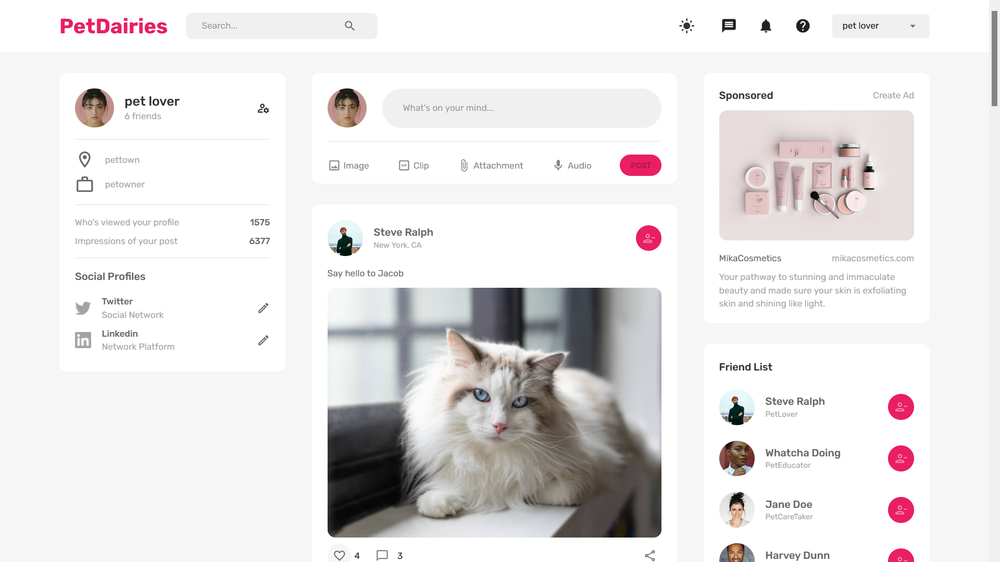

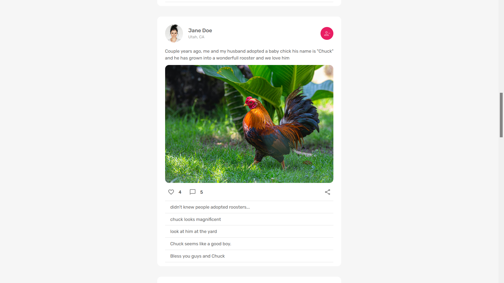

---

## Technologies used

MERN STACK

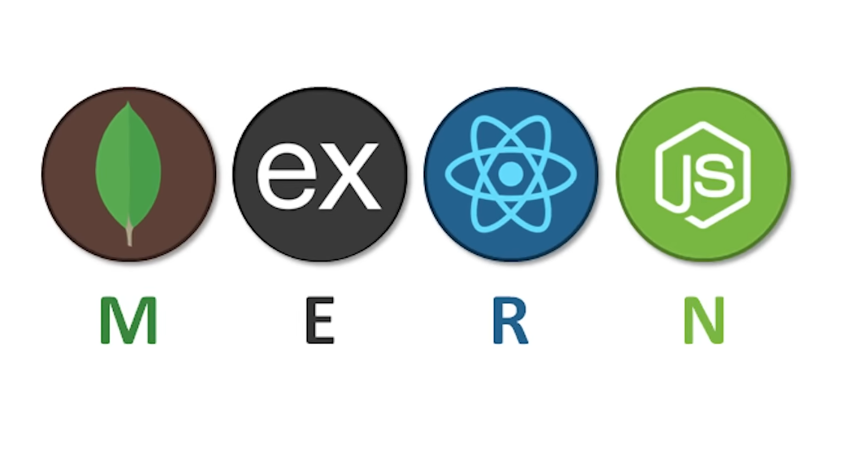

## FOR THE FRONTEND

REACT AS A FRONTEND FRAMEWORK

REACT ROUTER FOR NAVIGATION

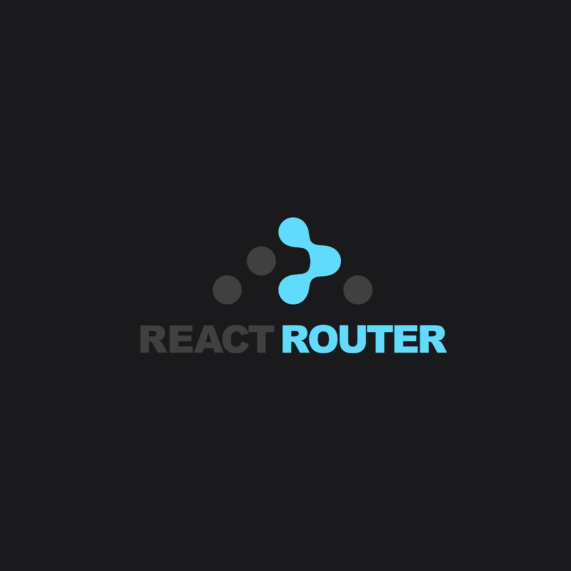

FORMIK AND YUP FOR FORM AND FORM VALIDATION

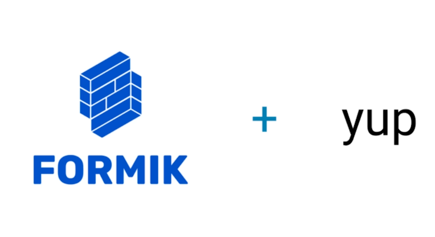

REDUX TOOLKIT FOR STATE MANAGEMENT

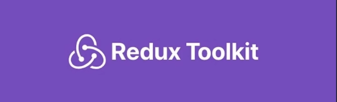

REDUX PERSISTENT TO STORE IN LOCAL STORAGE

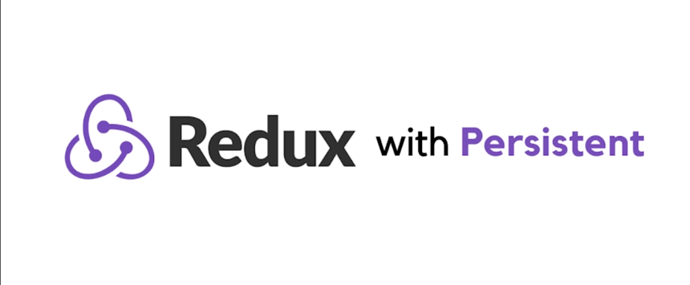

REACT DROPZONE FOR IMAGE UPLOADS

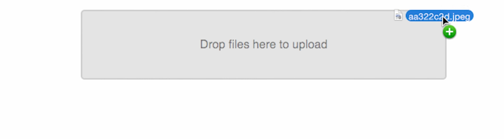

---

## FOR THE BACKEND

NODEJS AS RUNTIME

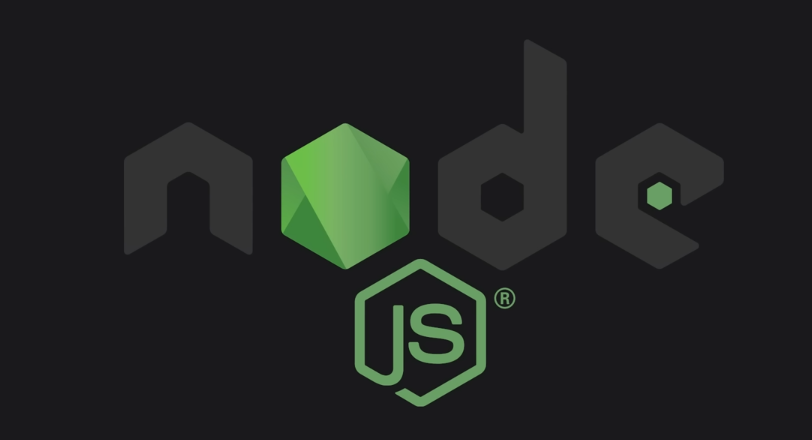

EXPRESSJS AS BACKEND FRAMEWORK

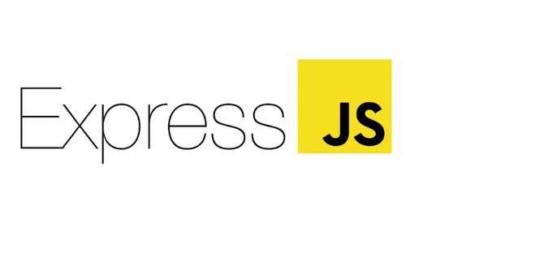

MONGODB FOR MANAGAING DATABASE

JSON WEB TOKEN FOR AUTHENTICATION

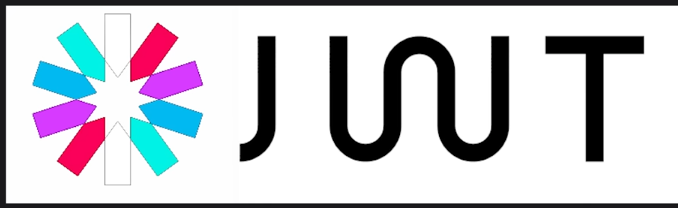

MULTER FOR FILE UPLOAD

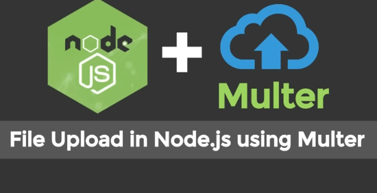

---
